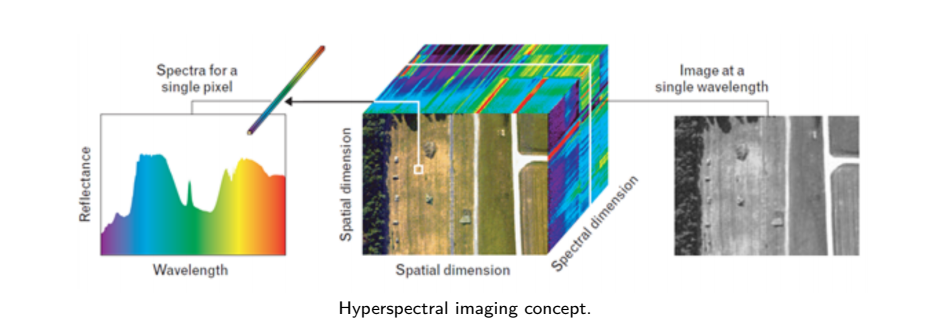
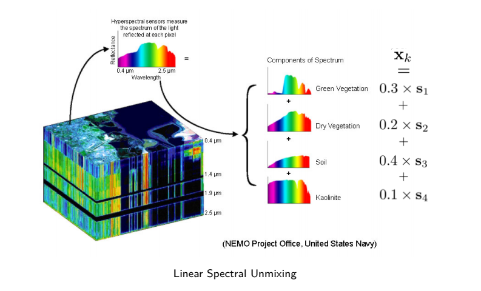

# Parallel Spectral Unmixing in Julia

## 📌 Project Goals

This project was designed with two main educational objectives in mind. First, it aims to demonstrate how to use parallel computing capabilities in Julia, a high-performance programming language well-suited for numerical analysis and scientific computing. Second, it provides a practical introduction to spectral unmixing techniques, a key tool in analyzing hyperspectral remote sensing data.

## 🌍 Background

### Hyperspectral Imaging

Hyperspectral images are a type of data captured across many narrow and contiguous spectral bands. Instead of just collecting color information like standard RGB images, hyperspectral images record a full reflectance spectrum for each pixel, often spanning the visible and near-infrared wavelengths. This detailed spectral information allows us to detect and identify materials based on how they reflect light at different wavelengths.

These images are commonly used in remote sensing applications such as environmental monitoring, precision agriculture, geology, and defense. However, due to the limited spatial resolution of hyperspectral sensors, a single pixel often contains a mixture of multiple materials. This phenomenon leads to the need for spectral unmixing. See bellow an example of hyperspectral image.

### Spectral Unmixing

Spectral unmixing is the process of determining the composition of each pixel in a hyperspectral image. In practice, we assume that each pixel’s spectrum is a mixture of a few basic components called endmembers. These endmembers represent the spectral signatures of pure materials such as green vegetation, dry vegetation, soil, or kaolinite. The goal of spectral unmixing is to identify the proportion of each endmember present in every pixel. This helps us understand the material composition of the scene, which is useful for a wide range of applications from land cover classification to mineral exploration. See bellow an illustration of the concept of spectral unmixing : 

## ⚙️ Parallel Computing in Julia

Parallel computing refers to performing many calculations at the same time, typically by distributing tasks across multiple CPU cores. The problem of spectral unmixing is naturally suited for this approach because each pixel in the image can be processed independently. This makes the problem "embarrassingly parallel" — a term used to describe tasks that require minimal coordination between parallel processes.

Julia provides excellent tools for parallelism, including distributed computing with multiple processes and high-level functions like `pmap` that make it easy to parallelize computations over large datasets. In this project, we leveraged these features to parallelize the spectral unmixing process by distributing the work of processing pixels across multiple workers. This results in faster execution times and demonstrates the efficiency of Julia for scientific workloads.
